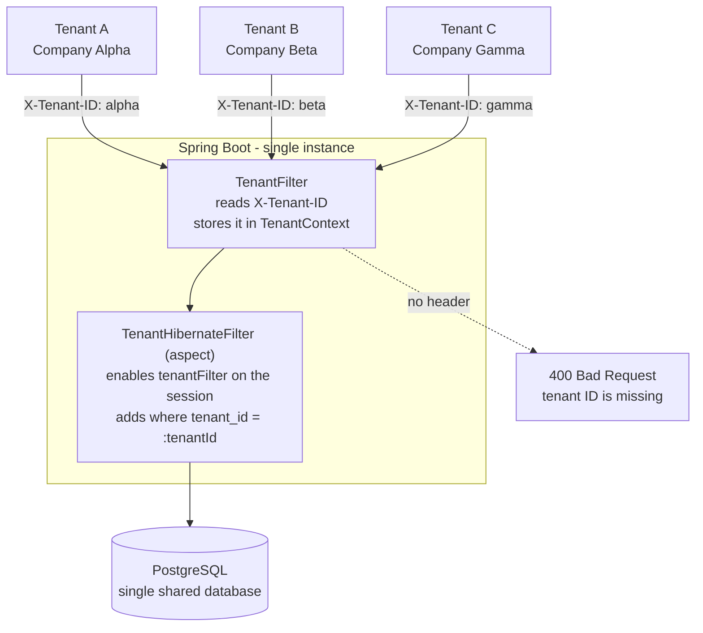

# Multi-Tenant Stock Management — Approach 1: Shared Schema

A single database, a single schema, and every row tagged with a `tenant_id`.
Hibernate appends `where tenant_id = ?` to queries automatically, so services
and controllers contain no tenant-aware code.

## How it works

All tenants share one database, one schema, and one set of tables. Rows are
separated by a `tenant_id` column, and Hibernate adds the `where` clause for you.



Every tenant's rows live side by side in the same table, told apart only by
`tenant_id`:

| id | tenant_id | name | price |
|----|-----------|------|-------|
| 1  | alpha     | Mechanical keyboard | 89.99 |
| 2  | alpha     | Ergonomic mouse     | 45.50 |
| 3  | beta      | 27-inch screen      | 349.00 |
| 4  | gamma     | HDMI cable          | 12.99 |

A request carrying `X-Tenant-ID: alpha` sees rows 1 and 2 only. The other rows
are invisible to it.

## Important

The service must be `@Transactional`. The aspect obtains the Session from the
EntityManager, and that Session only exists inside a transaction — without it
the filter is enabled on a throwaway Session and every tenant sees every row.

## Layout

```
common/       AbstractEntity (tenant_id, auditing, soft-delete flag), PageResponse
config/       TenantContext, TenantFilter, TenantHibernateFilter
entities/     Category, Product, StockMvt, TypeMvt
repositories/ mappers/ requests/ responses/
services/     BasicService<I,O> + per-entity interfaces, impl/
controllers/  CategoryController, ProductController, StockMvtController
```

## Endpoints

`/api/v1/categories`, `/api/v1/products`, `/api/v1/stocks`

Each supports POST, PUT `/{id}`, GET `/{id}`, GET `?page=&size=`, DELETE `/{id}`.
All require the `X-Tenant-ID` header.

## Running

```bash
docker compose up -d          # Postgres 17.5 on host port 5433
./mvnw spring-boot:run        # app on :8080
```

Flyway owns the schema (`db/migration/common`): **V1** creates the tables,
**V2** adds `tenant_id` to all three. `ddl-auto` is `validate`.

```bash
curl -H 'X-Tenant-ID: alpha' localhost:8080/api/v1/categories
```

## Known gaps

- `X-Tenant-ID` is self-asserted — no authentication yet, so any caller can
  claim any tenant. Security comes with approach 2.
- `findById` bypasses the filter entirely: Hibernate `@Filter` does not apply
  to primary-key lookups, so GET/PUT/DELETE by id can reach another tenant's row.
- Unique constraints on `categories.name` and `products.reference` are global,
  so two tenants can't reuse the same name or reference.
- Request DTOs carry no validation annotations, and there's no exception
  handler, so bad input surfaces as a 500.
